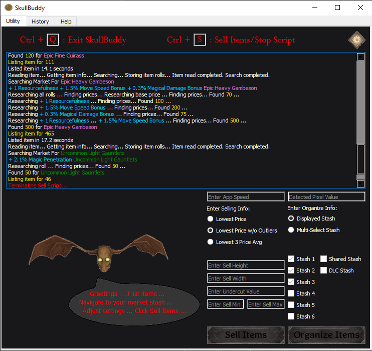
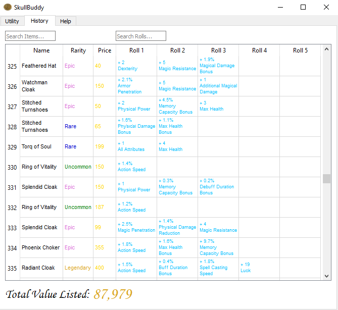

# Dark And Darker SkullBuddy

Play [Dark and Darker](https://www.darkanddarker.com/play) now for free!

SkullBuddy is an automation tool to quickly list loot on the marketplace and sort stash items in Dark and Darker.

<table>
  <tr>
    <td></td>
    <td></td>
  </tr>
</table>




## Requirements

Download and Install [Tesseract-OCR](https://github.com/UB-Mannheim/tesseract/releases)

Download and Install [Python](https://www.python.org/downloads/)

## Installation

Download Repo and run installer:
```bash
python python\install.py 1
```

After successful run, SkullBuddy.exe is generated in 
.../DaD_Automation/dist/SkullBuddy.exe
move SkullBuddy.exe out of dist folder and into repo root path. Example:
.../DaD_Automation/SkullBuddy.exe

Run SkullBuddy.exe

Enjoy!

## Disclaimer

SkullBuddy does not allow the user to hack, cheat, abuse, manipulate, 
change or otherwise obtain unauthorised access to any benefits or 
features in-game and does not automate gameplay mechanisms, only 
menu navigation. Skullbuddy uses the PyAutoGUI library for game navigation and a
combination of in-game screenshots and tesseract OCR to retrieve game data. 
Skullbuddy does not read game memory or access data not availble to the player by 
default. SkullBuddy only interacts with navigation outside of the dungeon.